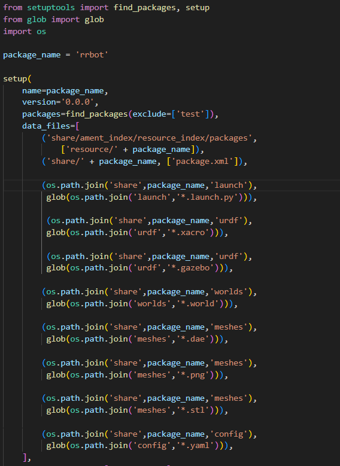
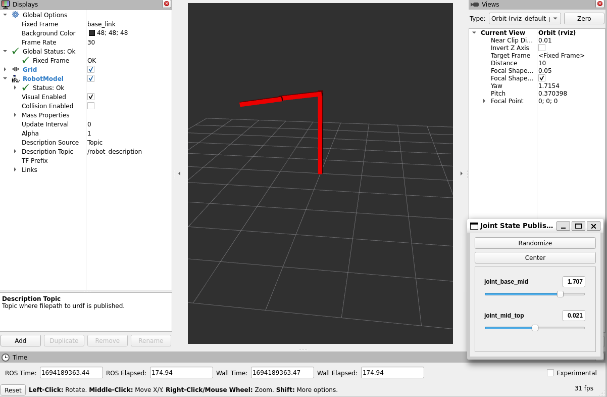
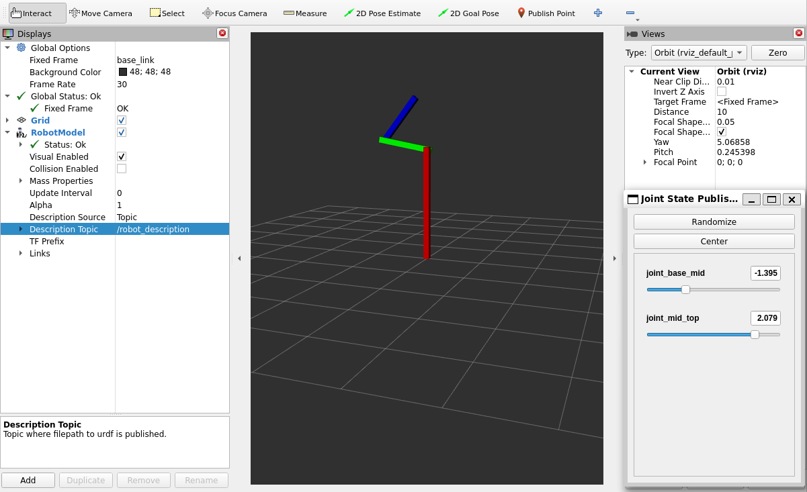
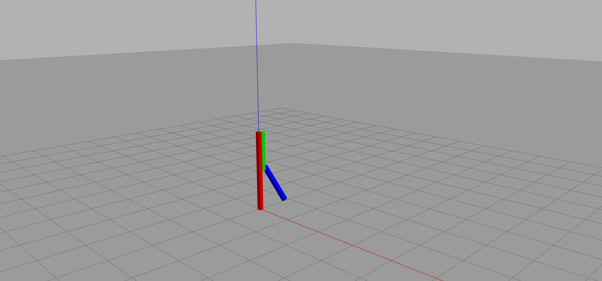
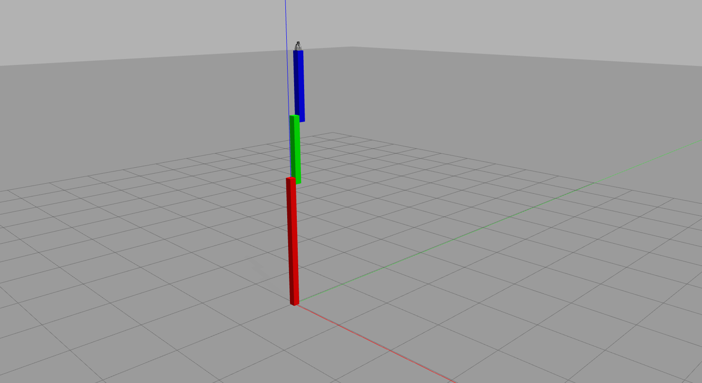
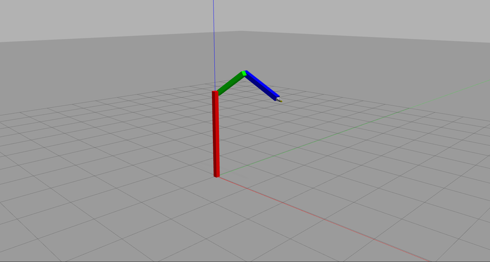
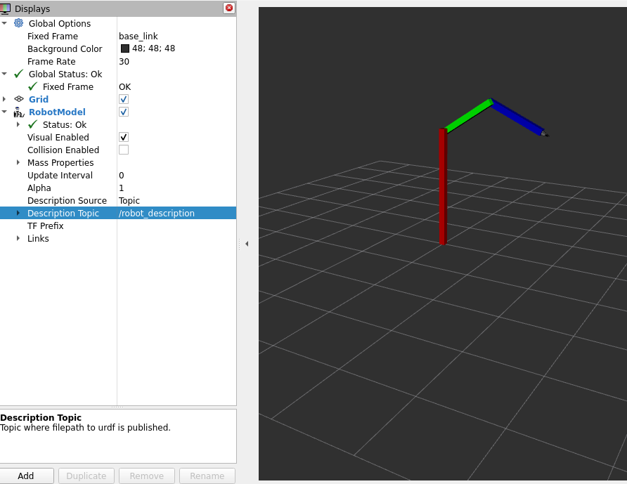
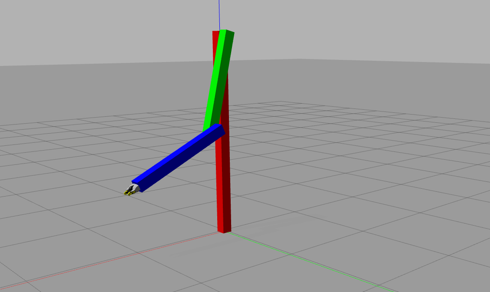

# Create your first robot arm
In this tutorial we will build a two degrees of freedom robotics arm using xacro methods. The simulated robot arm, rrbot, has two revolote joints and a gripper in the third which is a mesh file. 

Totally, you will learn the following:
- The advantages of using Xacro in a URDF
- Designing a three-link, two-join robotic arm using Xacro and mesh files.
- Controlling the arm in Gazebo classic using the ros2_control package. 

Before we move forward, in the following link you can find a presentation that will guide you through this tutorial. In the presentation you can find information about xacro properties, creating a new ROS 2 package and how to set up it. Also gives you information on how to build a two degree robot arm and how to use ros2_control package to control the robot.

- [rrbot package presantation](https://docs.google.com/presentation/d/1dzuV5KVsP0y9m2f1q3UD7XVk2-SVqx-K/edit?usp=drive_web&ouid=106628092038381749227&rtpof=true) Greek language.
- [rrbot package presantation]() English language (coming soon).

You can also see a video of the robots controller in this [link](https://drive.google.com/file/d/1ZgPk_ZAQrTe5CWucW98D_FNY3EvLar2H/view?usp=drive_link).


## Features of Xacro. 
Xacro is the XML macro language for ROS 2. Xacro provides a set of macro operation to replace some statements with sorter macros. Xacro can be used in any XML document, but is most usefull in long and complex URDF files. In Generally, xacro provides you methods that allow you to create more readable XML files for your URDF robot. 
Xacro provides you some advantages in many areas:
- **Properties and property block** : If repeated information is used in a URDF file, the property tag can be used to specify some constants. With the following expression you can create a constant named height and give it the value 0.5:
``` xml 
<xacro:property name=”height” value=”0.5” />
```
- **Simple math** : You can make some mathematicals calculation with the following operation +, -, * and /. The expression must be enclosed in the ${} construct. 

- **Macros** : This is the main feature of Xacro. You can create a macro by using the `<macro>` tag. Macros are helpfull when statements are repeated. 

- **Combining mulitple Xacro files** : Other Xacro file can be included in the main URDF file. You can use the following tag. `<xacro:include filename="$(find package_name)/filename" />`.

- Every xacro file must contain an extra declaration in the second line in the Xacro file. This declaration is vital for the file to parse properly. In every xacro file you must put the following
```xml
 <robot name="name_of_your_robot" xmlns:xacro="http://www.ros.org/wiki/xacro">
```

- More information about the xacro properties can be found [here](http://wiki.ros.org/xacro).

## Create, setup and build rrbot package. 

In this chapter, we will create a new ROS 2 packages using Python and setup the package.

Create rrbot package and build it:
```
cd ~/ros2_ws/src
ros2 pkg create --build-type ament-python rrbot
cd ~/ros2_ws
colcon build --packages-select rrbot
```

Create some folders in the package:
```
cd ~/ros2_ws/src/rrbot
mkdir urdf launch world meshes config
```

For building the packages in ROS 2 you must informed the setup.py file. In  this file you should make the following changes. At first, add two python libraries. 
``` py
import os
from glob import glob 
``` 
Also you must add the following paths to the data_files Python list.
```py
(os.path.join('share',package_name,'launch'),
         glob(os.path.join('launch','*.launch.py'))),
(os.path.join('share',package_name,'urdf'),
         glob(os.path.join('urdf','*.xacro'))),
(os.path.join('share',package_name,'urdf'),
         glob(os.path.join('urdf','*.gazebo'))),
(os.path.join('share',package_name,'worlds'),
         glob(os.path.join('worlds','*.world'))),
(os.path.join('share',package_name,'meshes'),
         glob(os.path.join('meshes','*.dae'))),
(os.path.join('share',package_name,'meshes'),
         glob(os.path.join('meshes','*.png'))),
(os.path.join('share',package_name,'config'),
         glob(os.path.join('config','*.yaml')))
```
The seutp.py file should look like this.



In the following step we will build our package using colcon tool.
```
cd ~/ros2_ws
colcon build --packages-select rrobt
```

## Create your first robot arm using xacro features.
For the first robot arm, we will build a URDF file that defines three links and two joins. Xacro features will be introduced to help us build the 2 degrees of freedom robot arm. Create a file named rrbot.xacro in th URDF folder of the package. The [rrbot.xacro](https://github.com/DimitrisKatos/rrbot/blob/master/urdf/rrbot.xacro) is the following :
```xml
<?xml version="1.0"?>
<!-- Revolute-Revolute Manipulator -->
<robot name="rrbot" xmlns:xacro="http://www.ros.org/wiki/xacro">

  <!-- Constants for robot dimensions -->
  <xacro:property name="width" value="0.1" />   <!-- Beams are square in length and width -->
  <xacro:property name="height1" value="2" />   <!-- Link 1 -->
  <xacro:property name="height2" value="1" />   <!-- Link 2 -->
  <xacro:property name="height3" value="1" />   <!-- Link 3 -->
  <xacro:property name="axle_offset" value="0.05" /> <!-- Space between joint and end of beam -->
  <xacro:property name="damp" value="0.7" />    <!-- damping coefficient -->

  <!-- Base Link -->
  <link name="base_link">
    <visual>
      <origin xyz="0 0 ${height1/2}" rpy="0 0 0"/>
      <geometry>
	<box size="${width} ${width} ${height1}"/>
      </geometry>
    </visual>

    <collision>
      <origin xyz="0 0 ${height1/2}" rpy="0 0 0"/>
      <geometry>
	<box size="${width} ${width} ${height1}"/>
      </geometry>
    </collision>

    <inertial>
      <origin xyz="0 0 ${height1/2}" rpy="0 0 0"/>
      <mass value="1"/>
      <inertia
	  ixx="1.0" ixy="0.0" ixz="0.0"
	  iyy="1.0" iyz="0.0"
	  izz="1.0"/>
    </inertial>
  </link>

  <!-- Joint between Base Link and Middle Link -->
  <joint name="joint_base_mid" type="revolute">
    <parent link="base_link"/>
    <child link="mid_link"/>
    <origin xyz="0 ${width} ${height1 - axle_offset}" rpy="0 0 0"/>
    <axis xyz="0 1 0"/>
    <dynamics damping="${damp}"/>
    <limit effort="100.0" velocity="0.5" lower="-3.14" upper="3.14" />
  </joint>

  <!-- Middle Link -->
  <link name="mid_link">
    <visual>
      <origin xyz="0 0 ${height2/2 - axle_offset}" rpy="0 0 0"/>
      <geometry>
	<box size="${width} ${width} ${height2}"/>
      </geometry>
    </visual>

    <collision>
      <origin xyz="0 0 ${height2/2 - axle_offset}" rpy="0 0 0"/>
      <geometry>
	<box size="${width} ${width} ${height2}"/>
      </geometry>
    </collision>

    <inertial>
      <origin xyz="0 0 ${height2/2 - axle_offset}" rpy="0 0 0"/>
      <mass value="1"/>
      <inertia
	  ixx="1.0" ixy="0.0" ixz="0.0"
	  iyy="1.0" iyz="0.0"
	  izz="1.0"/>
    </inertial>
  </link>

  <!-- Joint between Middle Link and Top Link -->
  <joint name="joint_mid_top" type="revolute">
    <parent link="mid_link"/>
    <child link="top_link"/>
    <origin xyz="0 ${width} ${height2 - axle_offset*2}" rpy="0 0 0"/>
    <axis xyz="0 1 0"/>
    <dynamics damping="${damp}"/>
    <limit effort="100.0" velocity="0.5" lower="-3.14" upper="3.14" />
  </joint>

  <!-- Top Link -->
  <link name="top_link">
    <visual>
      <origin xyz="0 0 ${height3/2 - axle_offset}" rpy="0 0 0"/>
      <geometry>
	<box size="${width} ${width} ${height3}"/>
      </geometry>
    </visual>

    <collision>
      <origin xyz="0 0 ${height3/2 - axle_offset}" rpy="0 0 0"/>
      <geometry>
	<box size="${width} ${width} ${height3}"/>
      </geometry>
    </collision>

    <inertial>
      <origin xyz="0 0 ${height3/2 - axle_offset}" rpy="0 0 0"/>
      <mass value="1"/>
      <inertia
	  ixx="1.0" ixy="0.0" ixz="0.0"
	  iyy="1.0" iyz="0.0"
	  izz="1.0"/>
    </inertial>
  </link>

</robot>
```

The above XML code defines a robot arm, labeled rrbot, which has three links which has 0.1 meters depth and width. The first link has 2 meter height and the other two has 1 meter height. In the following step we will create a new launch file to start Rviz2 and visualize the robot. Create a new file named [rrbot_rviz.launch.py](https://github.com/DimitrisKatos/rrbot/blob/master/launch/rrbot_rviz.launch.py) in the launch folder of the package. 
```py
from ament_index_python.packages import get_package_share_path

from launch import LaunchDescription
from launch.actions import DeclareLaunchArgument
from launch.conditions import IfCondition, UnlessCondition
from launch.substitutions import Command, LaunchConfiguration

from launch_ros.actions import Node
from launch_ros.parameter_descriptions import ParameterValue

def generate_launch_description():
    rrbot_path = get_package_share_path('rrbot')
    default_model_path = rrbot_path / 'urdf/rrbot4.xacro'
    

    gui_arg = DeclareLaunchArgument(name='gui', default_value='true', choices=['true', 'false'],
                                    description='Flag to enable joint_state_publisher_gui')
    model_arg = DeclareLaunchArgument(name='model', default_value=str(default_model_path),
                                      description='Absolute path to robot urdf file')
    robot_description = ParameterValue(Command(['xacro ', LaunchConfiguration('model')]),
                                       value_type=str)

    # Define all the Nodes which will start
    robot_state_publisher_node = Node(package='robot_state_publisher',
        executable='robot_state_publisher',parameters=[{'robot_description': robot_description}]    )

    # You can use either joint state publisher or joint state publisher gui.
    # When you launch this file, give an extra argument.
    # gui = True for joint state publisher gui, False for joint state publisher. 
    joint_state_publisher_node = Node(
        package='joint_state_publisher',  executable='joint_state_publisher',
        condition=UnlessCondition(LaunchConfiguration('gui')))

    joint_state_publisher_gui_node = Node( 
        package='joint_state_publisher_gui',executable='joint_state_publisher_gui',
        condition=IfCondition(LaunchConfiguration('gui')))

    rviz_node = Node(
        package='rviz2',executable='rviz2',
        name='rviz2', output='screen', )

    return LaunchDescription([
        gui_arg, model_arg, joint_state_publisher_node,
        joint_state_publisher_gui_node,robot_state_publisher_node,
        rviz_node ])
```

To start the launch you need to run the next commands. 
```
cd ~/ros2_ws
colcon build
cd src/rrbot # For WSL, run the next command
export LIBGL_ALWAYS_SOFTWARE=1 LIBGL_ALWAYS_INDIRECT=0
ros2 launch rrbot rrbot_rviz.launch.py model:=urdf/rrbot.xacro gui:='true'
```
The above launch file will start the Rviz, but the robot hasn't at the 3D environment. To visualize the robot you must maked some changes:
- Change the Fixed Frame to base_link.
- Select Add from Displays Panel.
- Select RobotModel.
- From Displays Panel, RobotModel change the Desciption Topic to /robot_description.

Now, the robot has been launch to the envirinment. Also you can check the joints from the Joint State Publisher gui. 



---
## Expanding Xacro
In the following step we will improve our robot model using more xacro features. You need to create a new robot model name [rrbot2.xacro](https://github.com/DimitrisKatos/rrbot/blob/master/urdf/rrbot2.xacro). The changes you will notice is the following.
- Xacro include method. The [materials.xacro](https://github.com/DimitrisKatos/rrbot/blob/master/urdf/materials.xacro) file defines colors for out robot. After defining the colors we use xacro:include method to import materials.xacro to [rrbot2.xacro](https://github.com/DimitrisKatos/rrbot/blob/master/urdf/rrbot2.xacro).
- In [rrbot2.xacro](https://github.com/DimitrisKatos/rrbot/blob/master/urdf/rrbot2.xacro) we use xacro macro to define the collision tags and also define the colors for every link.

Now you can visualize the robot in Rviz. Start the launch file and make changes to Rviz. The rrbot2.xacro is the following.



---
## Robot arm in Gazebo classic Simulator
ROS 2 and Gazebo can succesfully communicate by using some extra tags. This tags is the gazebo plugin tags.
In our robot we will use many gazebo plugins. First of all we will create a new file, [rrbot.gazebo](https://github.com/DimitrisKatos/rrbot/blob/master/urdf/rrbot.gazebo) in the urdf folder of the package. In this file we will define all the gazebo plugins. 

The rrbot.gazebo must be included in the URDF. So we create another robot model name [rrbot3.xacro](https://github.com/DimitrisKatos/rrbot/blob/master/urdf/rrbot3.xacro). In this file we use the xacro:include method to import the rrbot.gazebo file which gazebo plugins have been defined. The rrbot3.xacro has one more change than the previus model. We must connect the base_link to the ground plane. So you must add to your model the following.
```xml
  <!-- Used for fixing rrbot frame to Gazebo world frame -->
  <link name="world"/>

  <joint name="fixed" type="fixed">
    <parent link="world"/>
    <child link="base_link"/>
  </joint>
```

After creating this changes, we move forward on launching the robot to Gazebo using a launch file. In the launch folder create the file named [rrbot_gazebo.launch.py](https://github.com/DimitrisKatos/rrbot/blob/master/launch/rrbot_gazebo.launch.py):

```py
import os
from ament_index_python.packages import get_package_share_directory
from launch import LaunchDescription
from launch.actions import IncludeLaunchDescription
from launch.launch_description_sources import PythonLaunchDescriptionSource


from launch_ros.actions import Node
import xacro

def generate_launch_description():

    # Specify the name of the package and path to xacro file within the package
    pkg_name = 'rrbot'
    file_subpath = 'urdf/rrbot3.xacro'

    # Use xacro to process the file
    xacro_file = os.path.join(get_package_share_directory(pkg_name),file_subpath)
    robot_description_raw = xacro.process_file(xacro_file).toxml()

    # Configure the node
    node_robot_state_publisher = Node(package='robot_state_publisher',
        executable='robot_state_publisher', output='screen',
        parameters=[{'robot_description': robot_description_raw,
        'use_sim_time': True}] # add other parameters here if required
    )

    # Launch Gazebo
    gazebo = IncludeLaunchDescription(
        PythonLaunchDescriptionSource([os.path.join(
            get_package_share_directory('gazebo_ros'), 'launch'), '/gazebo.launch.py']),
        )

    spawn_entity = Node(package='gazebo_ros', executable='spawn_entity.py',
                    arguments=['-topic', 'robot_description','-entity', 'rrbot'],
                    output='screen')

    # Run the node
    return LaunchDescription([ gazebo, node_robot_state_publisher,
        spawn_entity ])
```

Run the next commands to start launch file. 
```
cd ~/ros2_ws
colcon build --package-select rrbot
cd src/rrbot # For WSL you need to run the next command.
export LIBGL_ALWAYS_SOFTWARE=1 LIBGL_ALWAYS_INDIRECT=0
ros2 launch rrbot rrbot_gazebo.launch.py
```
You will see the robot model in the Gazebo classic simulator.



## Adding a mesh file. 
A mesh file is a collection of polygonal surfaces that provides more realistic shapes in the URDF model. In our robot arm we will add a gripper to the top of the arm. You can find the gripper [here](https://github.com/DimitrisKatos/rrbot/tree/master/meshes). Download this files and paste them to meshes folder of the package. In the next step, create a new file in the urdf folder and names it [gripper.xacro](https://github.com/DimitrisKatos/rrbot/blob/master/urdf/gripper.xacro).

Create a new robot model named [rrbot4.xacro].(https://github.com/DimitrisKatos/rrbot/blob/master/urdf/rrbot4.xacro) and use the method include to import the gripper this model. If you want to launch the robot to gazebo, move to rrbot_gazebo.launch.py file and change the robot model.


Launch the rrbot_gazebo.launch.py and you can see the following.



---
## Control the arm with ros2_control.
For controlling the two degrees of freedom robot arm, we will use the ros2_control package. You must download the package from [here](https://control.ros.org/master/doc/getting_started/getting_started.html). After installing the ros2 control package, you can move forward to control your arm. You need to apply the next step:

- Create the [rrbot2.gazebo](https://github.com/DimitrisKatos/rrbot/blob/master/urdf/rrbot2.gazebo) file in the urdf folder. In this file we define all the Gazebo plugins. The newest plugin is the gazebo_ros2_control.
- In the config folder create the [rrbot_controllers.yaml](https://github.com/DimitrisKatos/rrbot/blob/master/config/rrbot_controllers.yaml) file. In this file, we define the pid controller for every joint and the gripper.
- Create the [rrbot_control.xacro](https://github.com/DimitrisKatos/rrbot/blob/master/urdf/rrbot_control.xacro) in the urdf folder. In this file has been defined the type of hardware the ros2 control will use. Also, we determine the type of controller (position controller) and the boundaries.
- Create a new launch file name rrbot_gazebo_control.launch.py. The file will spawn the robot to Gazebo and begin the controllers.

```
cd ~/ros2_ws
colcon build # For WSL, run the next command.
export LIBGL_ALWAYS_SOFTWARE=1 LIBGL_ALWAYS_INDIRECT=0
ros2 launch rrbot rrbot_control_gazebo.launch.py
```


Also you can start Rviz.
```
Rviz2
```
You need to make some changes to visualize the robot. When you make them you can see the robot has the same state as the simulator.




Now you can sent a desired position with the next commands. The next command sends a message to the /joint_base_mid_position_controller/follow_joint_trajectory action. 

```
ros2 action send_goal /joint_base_mid_position_controller/follow_joint_trajectory control_msgs/action/FollowJointTrajectory -f "{trajectory: { joint_names: [joint_base_mid],
    points: [ { positions: [-0.9], time_from_start: { sec: 2 } }, ] }}"
```


---
